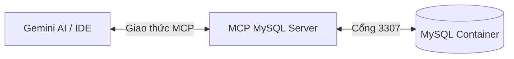
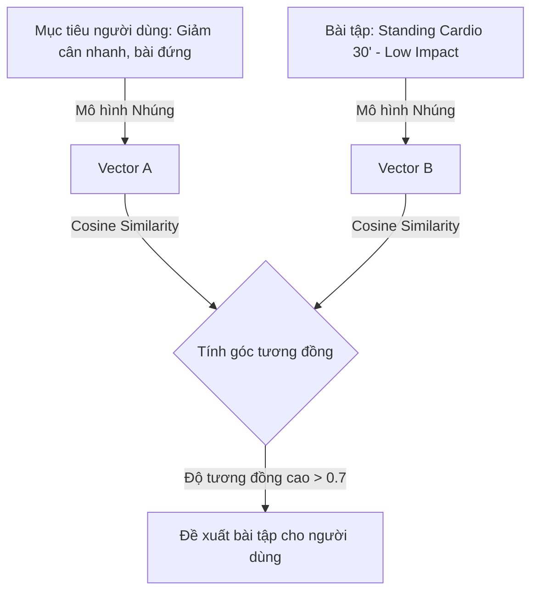

# Hướng Dẫn Học Tập & Khám Phá Công Nghệ (LEARNING.md)

Chào mừng bạn đến với tài liệu hướng dẫn học tập cho các công nghệ mới được tích hợp vào dự án **TrackFit**. Tài liệu này được biên soạn bằng tiếng Việt nhằm giúp bạn nắm vững kiến trúc, cách hoạt động và phương pháp triển khai của:
1. **Redis Cache** (Tối ưu hóa hiệu năng khuyến nghị).
2. **WebSocket & STOMP** (Giao tiếp thời gian thực - Hướng dẫn chi tiết & Code mẫu).
3. **Model Context Protocol (MCP) Server** (Kết nối Cơ sở dữ liệu trực tiếp với AI trợ lý).
4. **FastAPI AI Reco Service** (Microservice gợi ý bài tập bằng mô hình nhúng/Vector Similarity).

---

## 1. Redis Caching (Bộ nhớ đệm hiệu năng cao)

### 📌 Tại sao dùng Redis trong TrackFit?
Khi người dùng truy cập mục **Gợi ý bài tập**, backend Spring MVC sẽ cần:
1. Truy vấn danh sách bài tập từ database MySQL.
2. Gửi danh sách bài tập và mục tiêu sức khỏe của người dùng qua HTTP sang dịch vụ Python AI để tính toán điểm tương đồng (Cosine Similarity).
3. AI Service thực hiện xử lý bằng mô hình Deep Learning để chấm điểm và xếp hạng, sau đó phản hồi lại cho Spring MVC.

Quá trình này tốn từ **300ms đến hơn 1s** tùy thuộc vào số lượng bài tập và cấu hình phần cứng. Để tránh lãng phí tài nguyên và giúp ứng dụng phản hồi **ngay lập tức (< 5ms)** cho những lượt truy cập sau, hệ thống sử dụng **Redis** để lưu trữ (cache) kết quả gợi ý.

### 🛠️ Cấu hình trong Backend (Spring)
Redis được tích hợp thông qua **Spring Data Redis** và client **Lettuce**.

#### A. Khai báo Dependency (`pom.xml`):
```xml
<!-- Redis Connection & Caching -->
<dependency>
    <groupId>org.springframework.data</groupId>
    <artifactId>spring-data-redis</artifactId>
    <version>3.4.1</version>
</dependency>
<dependency>
    <groupId>io.lettuce</groupId>
    <artifactId>lettuce-core</artifactId>
    <version>6.4.1.RELEASE</version>
</dependency>
```

#### B. Class cấu hình [CacheConfig.java](file:///e:/TrackFit/TrackFitApp/src/main/java/com/ntn/configs/CacheConfig.java):
*   `redisConnectionFactory()`: Khởi tạo kết nối Lettuce trỏ tới container `redis` cổng `6379`.
*   `cacheManager()`: Cấu hình bộ quản lý cache của Spring sử dụng Redis, định nghĩa thời gian sống của dữ liệu (**Time-to-Live / TTL = 10 phút**) và bộ tuần tự hóa JSON (Serializer) giúp lưu dữ liệu dưới dạng JSON thay vì binary.

#### C. Áp dụng Cache trong Service [RecommendationServiceImpl.java](file:///e:/TrackFit/TrackFitApp/src/main/java/com/ntn/services/impl/RecommendationServiceImpl.java):
Sử dụng annotation `@Cacheable`:
```java
@Override
@Cacheable(
    value = "reco_exercises",
    key = "#p0 + '_' + (#p1.size==null?8:#p1.size) + '_' + "
         + "(#p1.kw==null?'':#p1.kw) + '_' + "
         + "(#p1.availableMinutes==null?25:#p1.availableMinutes) + '_' + "
         + "(#p1.intensity==null?'':#p1.intensity) + '_' + "
         + "(#p1.goalType==null?'':#p1.goalType)"
)
public List<RecommendationItemDTO> recommendExercises(String username, RecommendationParamsDTO params) {
    // Logic gọi AI và truy vấn dữ liệu...
}
```
*   `value = "reco_exercises"`: Định danh vùng nhớ cache (Namespace).
*   `key = ...`: Tạo khóa cache duy nhất dựa trên **username** và các tiêu chí lọc bài tập (`size`, `kw`, `availableMinutes`, `intensity`, `goalType`). Nếu người dùng yêu cầu cùng một bộ lọc, kết quả sẽ được lấy thẳng từ Redis mà không cần chạy lại hàm.

### 🧪 Cách kiểm tra Redis hoạt động
1. Đăng nhập vào ứng dụng và tải trang **Gợi ý bài tập**.
2. Mở terminal và chạy lệnh kiểm tra các khóa (keys) đang có trong container Redis:
   ```powershell
   docker exec trackfit-redis redis-cli keys "*"
   ```
   Bạn sẽ thấy một key dạng: `reco_exercises::testuser_8__25__` xuất hiện.
3. Để xem dữ liệu chi tiết bên trong key đó:
   ```powershell
   docker exec trackfit-redis redis-cli get "reco_exercises::testuser_8__25__"
   ```

---

## 2. WebSocket & STOMP (Giao tiếp thời gian thực)

### 📌 Trạng thái hiện tại
Trong file `package.json` của React, chúng ta đã cài đặt thư viện `@stomp/stompjs` và `sockjs-client`. Tuy nhiên, logic kết nối thời gian thực **chưa được kích hoạt** ở cả backend Spring và frontend React.

Dưới đây là hướng dẫn cụ thể từng bước để bạn tự tay triển khai hoặc bổ sung tính năng gửi thông báo thời gian thực (Real-time Notifications) qua WebSocket:

### 🛠️ Hướng dẫn tự triển khai Real-time qua WebSocket

#### Bước 1: Cấu hình Backend Spring
Tạo class cấu hình WebSocket để mở cổng và đăng ký broker:
```java
package com.ntn.configs;

import org.springframework.context.annotation.Configuration;
import org.springframework.messaging.simp.config.MessageBrokerRegistry;
import org.springframework.web.socket.config.annotation.EnableWebSocketMessageBroker;
import org.springframework.web.socket.config.annotation.StompEndpointRegistry;
import org.springframework.web.socket.config.annotation.WebSocketMessageBrokerConfigurer;

@Configuration
@EnableWebSocketMessageBroker // Kích hoạt message broker
public class WebSocketConfig implements WebSocketMessageBrokerConfigurer {

    @Override
    public void configureMessageBroker(MessageBrokerRegistry config) {
        // Kênh để client subscribe (lắng nghe) dữ liệu thời gian thực
        config.enableSimpleBroker("/topic", "/queue");
        // Tiền tố cho các request gửi từ client lên server xử lý
        config.setApplicationDestinationPrefixes("/app");
    }

    @Override
    public void registerStompEndpoints(StompEndpointRegistry registry) {
        // Cổng kết nối WebSocket ban đầu
        registry.addEndpoint("/ws")
                .setAllowedOriginPatterns("*") // Cho phép CORS
                .withSockJS(); // Fallback khi trình duyệt không hỗ trợ WebSocket thuần
    }
}
```

#### Bước 2: Gửi thông báo thời gian thực từ Service
Sử dụng `SimpMessagingTemplate` để gửi thông điệp tới client bất kỳ lúc nào:
```java
@Autowired
private SimpMessagingTemplate messagingTemplate;

public void sendRealtimeNotification(String username, String messageContent) {
    NotificationDTO notification = new NotificationDTO();
    notification.setContent(messageContent);
    notification.setCreatedAt(new Date());

    // Gửi thông báo riêng tư tới user cụ thể
    messagingTemplate.convertAndSendToUser(
        username, 
        "/queue/notifications", 
        notification
    );
}
```

#### Bước 3: Kết nối từ Client ReactJS
Tạo một custom hook hoặc file cấu hình kết nối STOMP Client trong React:
```javascript
import { Client } from '@stomp/stompjs';
import SockJS from 'sockjs-client';

const socket = new SockJS('http://localhost:8080/TrackFit/ws');
const stompClient = new Client({
  webSocketFactory: () => socket,
  debug: (str) => console.log(str),
  reconnectDelay: 5000, // Tự động kết nối lại sau 5s nếu mất mạng
});

stompClient.onConnect = (frame) => {
  console.log('Connected: ' + frame);
  
  // Lắng nghe kênh thông báo của riêng user này
  stompClient.subscribe('/user/queue/notifications', (message) => {
    const notification = JSON.parse(message.body);
    alert('Thông báo mới: ' + notification.content);
  });
};

stompClient.activate(); // Kích hoạt kết nối
```

---

## 3. Model Context Protocol (MCP) Server

### 📌 MCP là gì?
**Model Context Protocol (MCP)** là một giao thức mở do Anthropic phát triển, định nghĩa cách một ứng dụng AI (như trợ lý Gemini/Claude trong IDE của bạn) có thể kết nối an toàn với các nguồn dữ liệu bên ngoài như file cục bộ, API, và cơ sở dữ liệu.

Trong dự án này, trợ lý AI sử dụng một **MySQL MCP Server** chuyên biệt nằm tại thư mục [mcp-mysql-server](file:///e:/TrackFit/mcp-mysql-server) để kết nối trực tiếp đến MySQL DB đang chạy trong Docker.



### ⚙️ Cách hoạt động & Cấu hình
1. **Mã nguồn MCP Server**: Viết bằng Node.js ([index.js](file:///e:/TrackFit/mcp-mysql-server/index.js)), sử dụng thư viện `@modelcontextprotocol/sdk`. Nó định nghĩa các "công cụ" (tools) như `query_db`, `get_tables`, `describe_table` để AI có thể gọi.
2. **Cấu hình IDE**: Tọa lạc tại `C:\Users\nguye\.gemini\antigravity-ide\mcp_config.json`. File này hướng dẫn IDE khởi chạy MCP server bằng lệnh `node e:\TrackFit\mcp-mysql-server\index.js`.
3. **Ứng dụng thực tế**: Khi bạn chat với trợ lý AI và hỏi *"Trong cơ sở dữ liệu hiện tại có bao nhiêu bài tập?"*, AI sẽ:
   * Nhận ra câu hỏi cần dữ liệu database thật.
   * Kích hoạt tool của MCP Server để chạy lệnh SQL: `SELECT COUNT(*) FROM exercises`.
   * Nhận kết quả và trả lời cho bạn một cách chính xác mà không cần đoán mò.

---

## 4. FastAPI AI Reco Service (Microservice AI Khuyến nghị)

### 📌 Tại sao dùng Python Microservice?
*   **Spring MVC** rất mạnh về quản lý nghiệp vụ, giao dịch cơ sở dữ liệu và bảo mật (Spring Security).
*   **Python** là môi trường tiêu chuẩn cho Trí tuệ nhân tạo (AI/ML) nhờ có hệ sinh thái thư viện xử lý ngôn ngữ tự nhiên (NLP) vượt trội.
*   Do đó, chúng ta tách phần gợi ý thông minh thành một Microservice độc lập sử dụng **FastAPI** (Python) chạy trên cổng `8000`, giao tiếp với Java Backend qua giao thức RESTful API.

### 🧬 Giải thuật gợi ý dựa trên sự tương đồng Vector (Semantic Search)
Không giống như tìm kiếm từ khóa truyền thống (chỉ khớp chính xác từng chữ), AI service sử dụng mô hình ngôn ngữ **Sentence Transformers** để hiểu ý nghĩa ngữ cảnh:



1. **Vector hóa (Embedding)**: Chuyển đổi mục tiêu tập luyện (ví dụ: *"Lose weight, high intensity"*) và mô tả bài tập thành các chuỗi số (Vector) đại diện cho ngữ nghĩa của chúng.
2. **Cosine Similarity**: Tính toán góc giữa hai Vector trong không gian đa chiều. Vector càng gần nhau (điểm số gần `1.0`), bài tập càng phù hợp với người dùng.
3. **Fallback**: Nếu dịch vụ AI gặp sự cố hoặc bị tắt, Java Backend sẽ tự động phát hiện và chuyển sang cơ chế **Fallback (hạ cấp an toàn)**: tự động truy vấn các bài tập cơ bản trong DB theo target tương ứng để hệ thống không bị gián đoạn.

---
*Tài liệu này được tạo ra để đồng hành cùng quá trình học tập của bạn. Nếu có bất kỳ câu hỏi nào về cách hoạt động hoặc cách mở rộng các tính năng này, hãy thoải mái trao đổi với tôi!*
